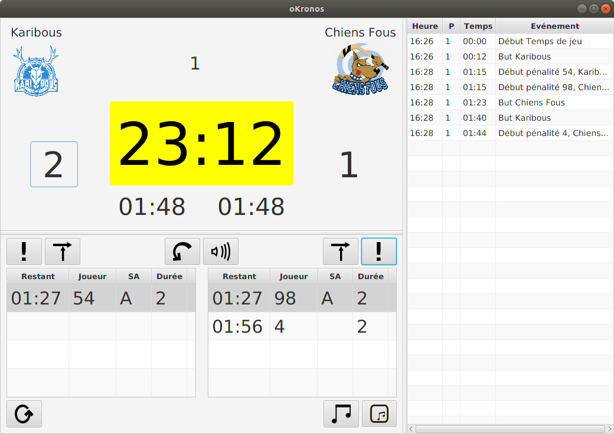

# oKronos timetable

## General presentation
oKronos is a timekeeper and score manager for hockey. It is a standalone application 
that runs on a personal computer with an Unix or Windows systems.

It uses two screens, the main screen to handle the action of the operator and display 
all data needed for him, and a second screen to display the time, score and penalties 
to the teams.
The operator uses mainly the mouse of the PC, and sometime the keyboard.

The operator window is in french but can be customized for other language.

### The operator window

### The score window

## Technical background
oKronos is written in java with the help of javafx graphics packages.

Any 64 bits modern O.S. can be used. oKronos build process produces a delivery for the Windows system
and another for the Linux system.

## Build

Before any build, you shall install some resources into the folder 'resources' :
- the javafx sdk 11.0.2 (https://gluonhq.com/products/javafx/)
    - for Linux: into resources/linux/javafx-sdk-11.0.2
    - for Windows: into resources/windows/javafx-sdk-11.0.2
- the launch4j cross-platform Java executable wrapper (https://sourceforge.net/projects/launch4j/files/launch4j-3/3.13/).
     - for Linux: into resources/linux/launch4j (required only to build on a Linux system).
     - for Windows: into resources/windows/launch4j (required only to build on a Windows system).

The application uses maven. Maven download some java library: you shall have got a valid connection to internet.
Build commands: 
- Into the directory okronos-parent: mvn clean install
- Into the directory okronos-core: mvn clean install
- Into the directory okronos-application: mvn clean package -DskipTests

The final delivery is generated into the folder okronos-application/target/dist .

## Installation
Once build, the delivery is contain into files names okronos-\<system\>-\<version\>.zip
Simply unzip the file.

## Execution
- On Windows : use okronos.exe or okronos.bat file.
- On Linux : use okronos.sh file.
 
## Modification 
You can use any editor or IDE.

Modifications can be perform with eclipse, but to prevent inline compilation errors:
- the package javax.xml shall been removed from the library xml-apis-1.0.b2.jar into the maven repository (usually $OME/.m2/repository/xml-apis/xml-apis/1.0.b2).
- lombok shall be added to eclipse: see https://projectlombok.org/setup/eclipse.

To run oKronos via eclipse : 
- add a new java application run configuration.
- add following vm arguments: "--module-path "../../resources/linux/javafx-sdk-11.0.2/lib" --add-modules=ALL-MODULE-PATH -Dconfigfile=src/test/dataset/init.properties"

## User documentation
You will find a general presentation into the folder doc/gen.

## Licence
The code is provided under the conditions of the GNU General Public License, version 3.
                       
## Design
Refer to the file okronos-application/src/main/javadoc/overview.html
or generate the javadoc.

## Customization
The application is customized with various configuration files. The file init.properties contains the paths of the
various folder that are used by the application and known as 'data set'. 
It also gives the name of the secondary configuration files, contain into the data set.
Therefore the application read first the init file and next the secondary configuration files.

The data set consist of:
  - Some configuration folders that contain the secondary configuration file and some files used to customized the display
  of the application.
  - Some image folders that contain the icones of the teams.
  - Some media folders that contain the music tracks and animation clips.

The init file can be used to control the configuration of the application : for example, to customize
the screen of score but keep the the other files unchanged, add a configuration folder, duplicate and modify the
score.fxml and score.css files, and add the path to this folder into the init file before any other configuration folder:
the application will scan the folders into the order they appear into the configuration file, and
as your file will be find first, it will be used. 

The name and location of the init file can be changed by the system property 'configfile'. 
In such a way you can build different launcher for different contexts.

## Contact
contact.okronos.scoretable@gmail.com

